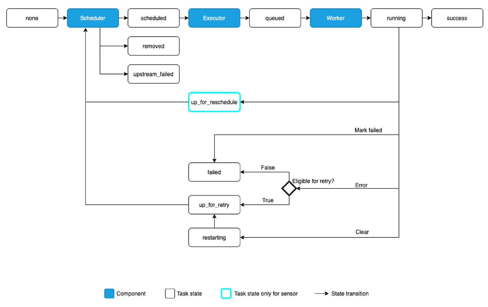

# DAG란? (Directed Acyclic Graph)
- Airflow에서 작업들의 실행순서를 정의하는 그래프
- 방향성과 비순환이 핵심 특징

## Task LifeCycle

---

## Task 주요 속성
| 속성               | 설명                                                                 |
|--------------------|----------------------------------------------------------------------|
| `task_id`          | Task의 고유 식별자 (DAG 내에서 유일해야 함)                         |
| `operator`         | Task가 수행할 작업을 정의 (예: `BashOperator`, `PythonOperator` 등) |
| `depends_on_past`  | 이전 실행 결과에 따라 Task 실행 여부 결정                            |
| `retries`          | Task 실패 시 재시도 횟수 설정 (기본값: 0)                            |
| `execution_timeout`| Task 실행 시간 제한 설정 (지정된 시간 내 미완료 시 실패 처리)        |
| `start_date`       | DAG 실행 시작 날짜 및 시간 설정                                      |
| `end_date`         | DAG 실행 종료 날짜 및 시간 설정                                      |
| `schedule_interval`| Task 실행 주기 설정 (예: `@daily`, `@hourly`, `0 12 * * *`)          |
| `priority_weight`  | Task의 실행 우선순위 설정 (높을수록 우선 실행)                       |
| `task_concurrency` | 특정 Task의 병렬 실행 가능 개수 제한                                 |

---

## 주요 Operator 종류
| 오퍼레이터 종류                          | 설명                                         | 예제                                                        |
|------------------------------------------|----------------------------------------------|-------------------------------------------------------------|
| Action Operators (기본 실행 오퍼레이터)  | 특정 동작을 수행하는 오퍼레이터              | `PythonOperator`, `BashOperator`, `EmailOperator`           |
| Sensor Operators (센서 오퍼레이터)       | 특정 이벤트를 감지할 때까지 대기             | `FileSensor`, `HttpSensor`, `S3KeySensor`                   |
| Transfer Operators (데이터 전송 오퍼레이터) | 한 위치에서 다른 위치로 데이터를 이동         | `S3ToGCSOperator`, `MySQLToGCSOperator`                     |
| Database Operators (데이터베이스 관련 오퍼레이터) | DB에서 SQL을 실행하는 오퍼레이터             | `PostgresOperator`, `MySqlOperator`, `SnowflakeOperator`    |
| Big Data & ML Operators (빅데이터 & 머신러닝 오퍼레이터) | Spark, Hive, Dataproc, ML 관련 오퍼레이터     | `SparkSubmitOperator`, `DataflowOperator`                   |
| Docker & Kubernetes Operators            | 컨테이너 환경에서 실행                        | `DockerOperator`, `KubernetesPodOperator`                   |
| Dummy Operators                          | Task 흐름을 설정하는 데 사용                 | `DummyOperator` (또는 `EmptyOperator`)                      |
