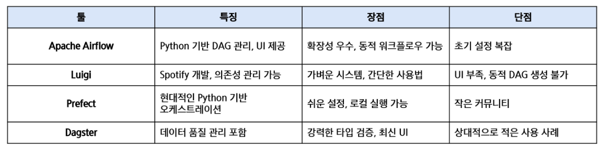
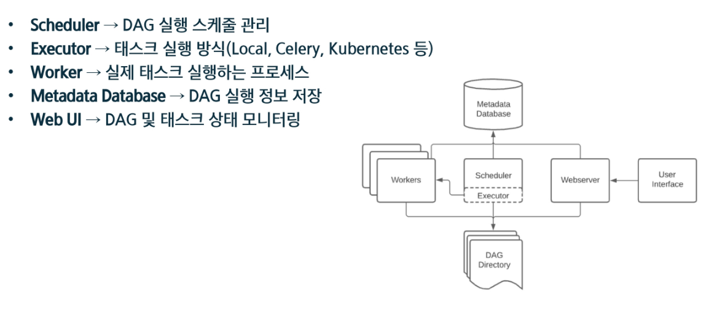
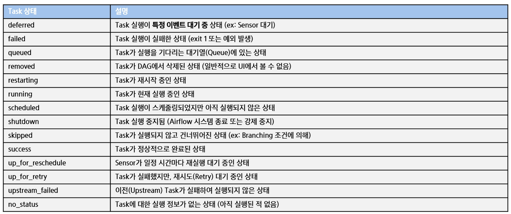
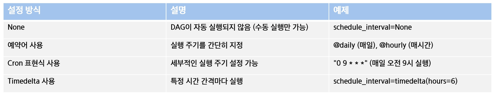

Airflow = 워크플로우 오케스트레이션
  = 작업(Task)을 정해진 순서에 따라 실행하고 자동화하는 기술
  데이터 파이프라인, 머신러닝, CI/CD등 다양한 분야에서 활용

주로 하는 작업
- 작업 자동화
- 의존성 관리
- 실패 처리 및 모니터링
- 스케줄링 기능

### Infrastructure Management
- Airflow를 활용한 인프라 배포 및 운영 자동화
  - 클라우드 리소스 자동 프로비저인
  - Airflow를 활용한 인프라 배포 및 운영 자동화
  - CI/CD 파이프라인 자동 실행
  - Kubernetes 및 서버 배포 자동화

### MLOps
- Airflow를 활용한 머신러닝 파이프라인 자동화
  - 데이터 수집 -> 모델 학습 -> 평가 -> 배포 과정 자동화
  - 머신러닝 워크플로우 오케스트레이션
  - 모델 재학습 및 모니터링 자동

## Why Airflow?
기존의 방식에는 한계가 존재.
1. 작업 간 의존성 관리 어려움
2. 장애 발생 시 원인 추적 및 복구 어려움
3. 로그 관리 및 모니터링 부족


도입시 장점은?
1. DAG 기반 의존성 관리
2. Web UI 제공
3. 재시도 및 알림 기능
4. 확장성 및 유연성



---

## Airflow 장단점
장점
1. Python 기반
2. 강력한 UI
3. Task 간 의존성 관리 용이
4. 확장성 높음
5. 장애 복구 기능 제공


단점
1. 초기 설정 및 학습 곡선이 가파름
2. 실시간 데이터 처리에는 적합하지 않음
3. 복잡한 DAG의 경우 성능 튜닝 필요


## Airflow 설치
```bash
curl -LfO 'https://airflow.apache.org/docs/apache-airflow/3.0.0/docker-compose.yaml'

mkdir -p ./dags ./logs ./plugins ./config

echo -e "AIRFLOW_UID=$(id -u)" > .env

docker compose up airflow-init

docker compose up
```

## Airflow 종료
```bash
docker compose down --volumes --rmi all 
```

## Airflow Web UI
1. `http://localhost:8080`
2. ID: airflow, PW: airflow

---

## 용어들
DAG
- Airflow의 작업들의 실행 순서를 정의하는 그래프
- 방향성 : 작업들이 정해진 순서로 실행됨
- 비순환 : 순환 구조가 없어 무한 실행 방지

Task
- 워크플로우를 구성하는 개별 작업 단위
- ETL, 데이터변환, 머신러닝 모델 실행, 파일 이동 등의 작업을 수행할 수 있음
- 워크플로우를 구성하는 기본 요소


## Airflow 핵심 컴포넌트



## Task의 상태 종류


## Scehduling 방법
`schedule_interval` 옵션을 통해 설정 가능


예시
```python
dag = DAG(
  dag_id = "schedule_test",
  start_date = datetime(2025, 4, 23),
  schedule_interval="0 6 * * *",  # 매일 오전 6시 실행 (Cron 표현식)
  catchup=False
)
```
---
