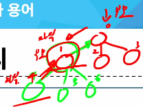
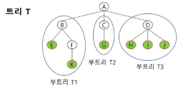
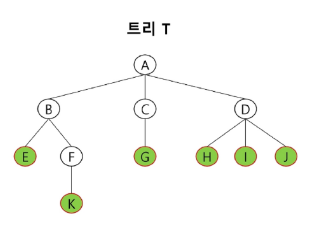
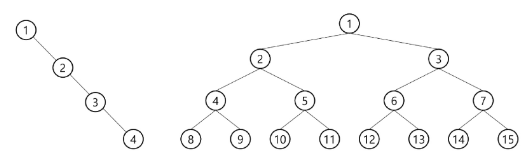
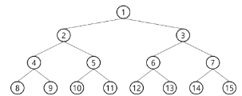
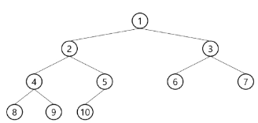
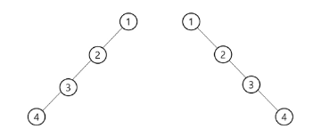

# 트리
- 비선형 구조
- 원소들 간에 1:N 관계를 가지는 자료구조
- 원소들 간에 계층관계를 가지는 계층형 자료구조
- 상위 원소에서 하위 원소로 내려가면서 확장되는 트리(나무)모양의 구조
- 이런 형태를 가진다.

## 트리 정의
- 한 개 이상으 노드로 이루어진 유한 집합이며 다음 조건을 만족한다.
    - 노드 중 최상위 노드를 루트라 한다.
    - 나머지 노드들은 n(>=0))개의 분리 집합으로 분리될 수 있다.
- 분리 집학 각각은 하나의 트리가 되며, 이를 루트의 부 트리(subtree)라 한다.

## 트리 용어

1. 노드(node)
    - 트리의 원소
    - A, B, C, D, E, F, G, H, I, J, K
2. 간선(edge)
    - 노드와 노드를 연결하는 선
    - 부모 노드와 자식 노드를 연결
3. 루트 노드(root node)
    - 트리의 시작 노드인 최상위 노드
    - 트리 T의 루트 노드 = A
4. 형제 노드
    - 노드간에 같은 부모 노드를 가진다면 이를 형제 노드라고 한다.
5. 차수(degree)
    - 노드의 차수
        - 노드에 연결된 자식 노드 수
        - B의 차수 = 2, C의 차수 = 1
    - 트리의 차수
        - 트리에 있는 노드의 차수 중에서 가장 큰 값
        - 트리 T의 차수 = 3
    - 단말 노드(leaf node)
        - 차수가 0인 노드. 즉, 자식 노드가 없는 노드
6. 레벨
    - 루트에서 노드까지의 거리
    - 루트 노드의 레벨은 0, 자식 노드의 레벨은 부모 레벨 +1
7. 높이
    - 루트 노드에서 가장 먼 리프 노드까지의 간선 수
    - 트리의 높이는 최대 레벨(트리 T의 높이 = 3)

# 이진 트리(Binary Tree)
- 차수가 2인 트리
- 각 노드가 자식 노드를 최대 2개 까지만 가질 수 있는 트리 (왼쪽/ 오른쪽 자식 노드)
- 모든 노드들이 최대 2개의 서브 트리를 갖는 특별한 형태의 트리

## 이진 트리 특성
- 레벨 i에서의 노드의 최대 개수는 2^i개
- 높이가 h인 이진 트리가 기질 수 있는 노드의 최소 개수는 (h+1)개가 되며, 최대 개수는 (2^i -1)개가 된다.

## 포화 이진 트리(Perfect Binary Tree)
- 모든 레벨에 노드가 포화 생태로 차 있는 이진트리
- 높이가 h일 때, 최대 노드 개수인 (2^h -1)개의 노드를 가진 이진 트리
- 루트를 1번으로 하여 (2^{h+1} -1)까지 정해진 위치에 대한 노드 번호를 가짐

## 완전 이진 트리(complete Binary Tree)
- 포화 이진 트리는 아니지만 순서대로 자식트리가 배치된 상태.
- 탐색에 있어 효율성을 위해 중요하다.

## 편향 이진 트리(Skewed Binary Tree)
- 높이 h에 대한 최소 개수의 노드를 가지면서 한쪽 방향의 자식 노드만을 가진 이진 트리
    - 왼쪽 편향, 오른쪽 편향
    

