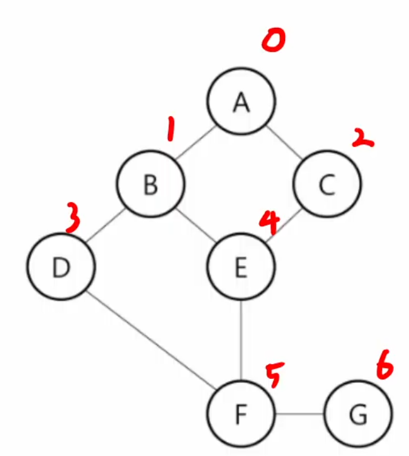
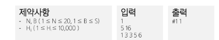

# DFS
> DSF : 깊이 우선 탐색

## 목차
> - DFS
>   - 비선형 자료구조
>   - DFS(트리)
>   - DFS(그래프)
> - DFS 문제 풀이
>   - 장훈이의 높은 선반
>   - 동철이의 일 분배

## DFS
### 비선형 자료구조
> 비선형 구조인 트리, 그래프의 각 노드를 중복되지 않게 전부 방문하는 것을 말한다.<br>
> 비선형 구조는 선형 구조와 다르게 선후 관계를 알 수 없다.<br>
> => 특별한 방법이 필요하다.

> 이를 위한 두 가지 방법
> 1. 깊이 우선 탐색(Depth First Search)
> 2. 너비 우선 탐색(Breadth First Search)
### DSF(트리)
> - 루트 노드에서 출발하여 한 방향으로 갈 수 있는 경로가 있는 곳까지 
> 깊이 탐색해 가다가 더 이상 갈 곳이 없게 되면, 가장 마지막에 만났던 
> 갈림길 간선이 있는 노드로 되돌아와서 다른 방향의 노드로 탐색을 계속 
> 반복하여 결국 모든 노드를 방문하는 순회 방법
> <br><br>
> - 가장 마지막에 만났던 갈림길의 노드로 되돌아가서 다시 깊이 우선 탐색을 
> 반복해야 하므로 재귀적으로 구현하거나 **후입선출 구조의 스택**을 사용해서 구현

```python
# 간단한 DFS 수도코드
DFS(v):
    v 방문
    for (v의 모든 자신 노드들 w):
        DFS(w)
```

### DSF(그래프)
> - 시작 정점에서 출발하여 한 방향으로 갈 수 있는 경로가 있는 곳까지
> 깊이 탐색해 가다가 더이상 갈 곳이 없게 되면, 가장 마지막에 만났던
> 갈림길 간선이 있는 정점으로 되돌아와서 다른 방향의 정점으로 탐색을
> 계속 반복하여 결국 모든 정점을 방문하는 순회 방법

> **트리와 차이점** <br>
> 그래프는 단방향이 아니기 때문에 방문했는지 확인이 필요함.
> <br> = 그래프는 사이클이 발생할 수 있다.



> 재귀 방식과 stack 방식 둘 다 가능. 성능 차이는 거의 없다.
> 두 방식의 탐색 순서는 다를 수 있다.


## 문제 풀이
### 1486. 장훈이의 높은 선반
    서점에는 높이가 B인 선반이 하나 있는데 장훈이는 키가 매우 크기 때문에, 
    선반 위의 물건을 자유롭게 사용할 수 있다.
    서점에 있는 N명의 점원들이 장훈이가 선반 위에 올려놓은 물건을 사용해야 한다.
    각 점원의 키는 Hi이고 점원들은 탑을 쌓아 선반 위의 물건을 사용하기로 하였다.
    점원들이 쌓는 탑은 점원 1명 이상으로 이루어져 있다.
    탑의 높이는 점원이 1명일 경우, 그 점원의 키와 같고, 
    2명 이상일 경우 탑을 만든 모든 점원의 키의 합과 같다.
    탑의 높이가 B 이상인 경우 선반 위의 물건을 사용할 수 있는데,
    탑의 높이가 높을수록 더 위험하므로 높이가 B 이상인 탐 중에서
    높이가 가장 낮은 탑을 알아내려고 한다.
    출력 : 선반의 높이와 탑 사이의 차이가 가장 작은 경우를 출력하라


> bit연산과 조합으로 해결 가능한데, bit 연산자가 조금 더 빠르다.

내가 구현하는 것 보다 itertools의 combinations를 사용하면 더 빠르다.
그 이유는 제너레이터를 사용해서 그렇다.

하지만 DFS로 구현한 것이 가장 빠르다. <br>
왜냐하면, 조건을 통해 모든 경우의 수를 계산하지 않기 때문이다.

