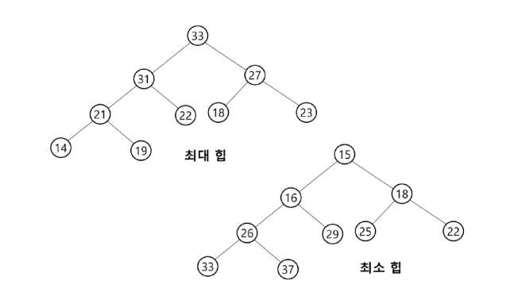

# Heap
> - 완전 이진 트리에 있는 노드 중에서 키 값이 가장 큰 노드나 키 값이 가장 작은 노드를 찾기 위해서 만든 자료구조
> - 최대 힙(max heap)
>   - 키 값이 가장 큰 노드를 찾기 위한 완전 이진 트리
>   - 부모 노드의 키 값 > 자식 노드의 키 값
>   - 루트 노드: 키 값이 가장 큰 노드
> - 최소 힙(min heap)

## 힙 성질
1. 최대 힙과 최소 힙 모두 서브 트리로 나누어도 모두 성질이 유지된다.

2. 힙은 "완전 이진 트리"여야 한다.
3. 정렬을 보장하지 않는다.

## 힙 연산 - 삽입
1. 우선 제일 뒤에 추가한다.
2. 부모 노드와 비교하여 본인보다 작으면 자리를 바꾼다.
3. 더 이상 바꿀 수 없을 때 까지 2번 과정을 반복한다.

## 힙 연산 - 삭제
- 힙에서 삭제는 루트 원소만 가능하다.

1. 루트 노드 원소값 삭제
2. 마지감 노드 삭제하면서 루트 노드에 값 입력
3. 루트 노드의 자식 노드 비교하면서 재정렬

## 우선순위 큐(Priority Queue)
> - 우선순위를 가진 항목들을 저장하는 큐
> - FIFO 순서가 아니라 우선순위가 높은 순서대로 먼저 나가게 된다.
> - 우선순위 큐를 구현하는 가장 효율적인 방법은 힙을 사용하는 것이다.
> - 노드 하나의 추가 삭제의 시간 복잡도가 O(logN)이며, 최대값/최소값을 O(1)에 구할 수 있다.

쉽게 이야기 하면 heap으로 구성되어 있는 자료구조는 queue 처럼 사용하는 것.

Queue에서 중요한건 삽입 위치와 출력 위치가 다르다는 사실이다.
그렇기 때문에 FIFO를 포기하고 heap을 통해 정렬된 리스트를 queue처럼 삽입과 출력을 하는 것이다.

# 백트래킹(BackTracking)

