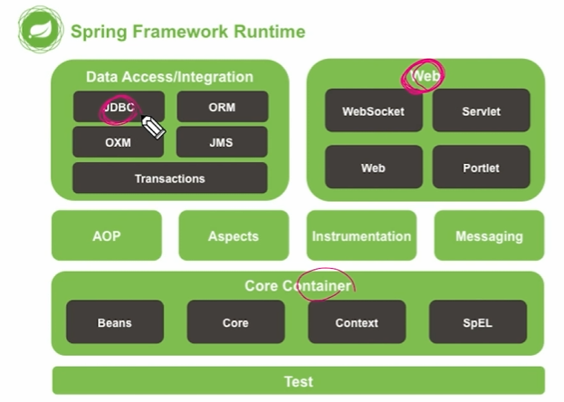

# Spring DI
- Spring Framework
- 의존관계 역전
- 의존성 주입
- Spring Container Build
- Spring DI
    1. XML
    2. Annotation
    3. Java Config

## Spring Framework
### Framework?
- 사전적 의미 : 뼈대, 틀
- SW에서의 의미 : SW 특정 문제를 해결하기 위해서 상호 협력하는 클래스와 인터페이스의 집합

### Framework 왜 사용하는가?
- 웹 어플리케이션을 개발하기 위해서는 많은 기본 기능을 설계, 작성해야 한다.
- 공통으로 사용되는 기본 기능들을 일관되게 상요할 수 있으면 개발자는 웹 어플리케이션 기능 자체 개발에만 신경을 쓰면 되기 때문에 생산성이 높아진다.
- 개발자 입장에서는 완성된 구조에 맡은 기능을 개발하여 넣어주면 되기 때문에 개발 시간을 단축할 수 있다.

### Spring Framework의 등장
- 과거 자바에서는 EJB(Enterprise JavaBeans)를 이용해 엔트프라이즈 급 어플리케이션 제작
-> But 너무 무거웠음. 그래서 나온게 Spring

    - 경량 컨테이너 사용
    - 의존성 주입 (Dependency Injection)
    - AOP (Aspect Oriented Programming, 관점 지향 프로그래밍)
    - POJO (Plain Old Java Object)
    - 등의 개념 등장

### Spring Framework의 특징
- POJO 방식의 프레임워크
- 의존성 주입을 통한 객체관계 구성
- 관점지향 프로그래밍
- 제어 역전 (IoC)
- 높은 확장성과 다양한 라이브러리
- ...

### Why Spring Framework?
1. Spring is everywhere
2. Spring is flexible
3. Spring is productive
4. Spring is fast
5. Spring is secure
6. Spring is supportive

### Spring Framework Runtime

## 의존관계 역전
### 프로그래머와 컴퓨터
